# Microstrip low-pass filter ([Project file](prj_microstrip_low_pass_filter.emstudio))

[][1]

This sample replicates one of the results from the paper [Application of the three-dimensional finite-difference time-domain method to the analysis of planar microstrip circuits][1], published in the IEEE Transactions on Microwave Theory and Techniques, vol. 38, no. 7, July 1990.

In this paper, the authors simulated a line-fed rectangular microstrip antenna shown in Fig. 1. To simulate this problem, the authors used a FDTD grid with delta_x = 0.4064 mm, delta_y = 0.4233 mm, and delta_z = 0.265 mm. The grid has 80 x 100 x 16 cells. The long rectangular patch has dimensions 50 * delta_x and 6 * delta_y in the x and y axis. The distance from the source plane to the edge of the long path is 50 * delta_y. The reference planes for ports 1 and 2 are 10 * delta_y from the edges of the patch. The strip widths of the ports 1 and 2 are 6 * delta_x.

The problem consists in calculate the S11 and S21 of this filter for frequencies below 20 GHz.

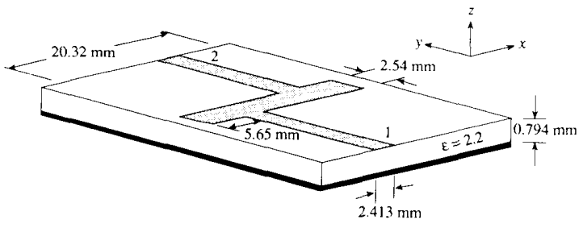

Fig. 1 - Problem definition - [Source of the figure][1].

## Configuring the project in EM Studio

Figure 2 shows EM Studio main screen. The left bottom section (2) shows all the available itens that can be to build a project. The left upper section (1) shows the project configuration. The right section (3) shows the visualization of the project. In the second panel of the status bar, the user can view (4) the units used by the project.

Fig. 2 - EM Studio main screen.

We will start configuring the project units. This can be done using the menu `Configure`>`Units` or using the button `Units` in the toolbar. EM Studio will show a screen to configure the units - Fig. 3. For this project, set space units as mm, time as ps and frequency as GHz.

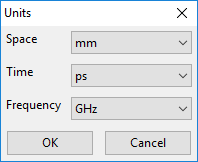

Fig. 3 - Configuring units.

To configure the project, we will use some symbols. Use the menu `Configure`>`Symbols` (or the button `Symbols` in the toolbar). EM Studio will show a screen to configure some symbols. For this project, set the symbols as shown inf Fig. 4. Latter we will use this symbol to define some elements properties. EM Studio  allows you to use symbols in some elements propertiers.

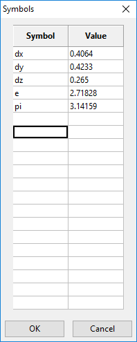

Fig. 4 - Symbols

Now, let's configure the FDTD grid. Double click at the FDTD icon in the project properties (section 1 of Fig. 1). Set the properties:

- Lower Boundary: (0, 0, 0)
- Upper Boundary: (80 * dx, 100 * dy, 16 * dz)
- Number of Cells (X): 80
- Number of Cells (Y): 100
- Number of Cells (Z): 16
- Time steps: 4000
- ABC: PML in all axis, with Npml = 8

Fig. 5 shows the FDTD properties window with its Upper Boundary property available for edition. Note that the symbols previously defined can be used to define the property of the elements. Sometimes it is easier to let EM Studio do the math for you.

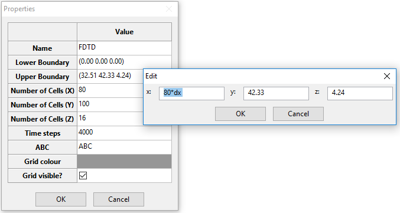

Fig. 5 - Editing Upper Boundary property of the element FDTD.

To define the microstrip it is necessary to define the material for the substrate. In this example, the relativ electric permitivity of the substrate is 2.2. EM Studio has a material library that can be accessed using the menu `Configure`>`Material Library` (or the button `Library` in the toolbar). To create a new material, go the the Material Library and click at the `New` button. Then, configure the material as shown in Fig. 6.

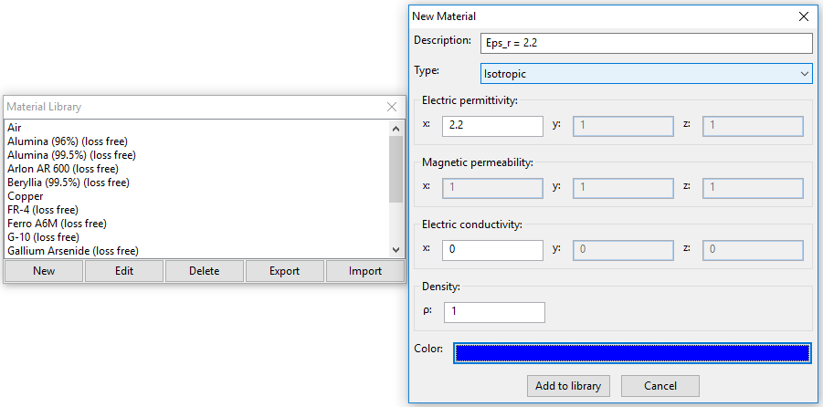

Fig. 6 - Creating a new material.

Now, double click the Microstrip icon in the Available items section (section 2 of Fig. 2). EM Studio will show the Microstrip properties. Set the properties:

- Lower Boundary: (0, 0, 0)
- Upper Boundary: (80 * dx, 100 * dy, 3 * dz)
- Substrate: Eps_r = 2.2
- Line position (X): (80-50)*dx/2 + 5.65 + 2.413/2
- Line length: 50 * dy
- Line width: 2.413
- Pec under substrate?: Checked
- Match with PML: Checked (+Y)
- Excitation: Gaussian with amplitude 1 and frequency 25
- Ports: 1
  - Coordinate-X: 15 * dx + 50 * dx - 5.65 - 6 * dx + 3 * dx
  - Coordinate-Y: 90 * dy
- Line impedance: 50
- Initial frequency: 0.5
- Frequency step: (20-0.5)/1000
- N frequencies: 1000
- Solid?: Unchecked
- Visible?: Checked

Fig. 7 shows the Microstrip properties. Note that the properties window shows the evaluated expression of the properties defined with equations. You don't need to use equations. You can just set the final number.

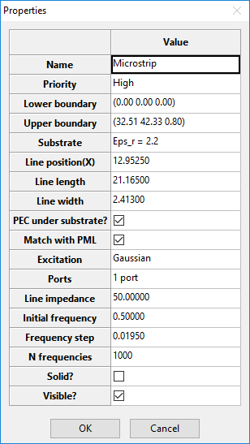

Fig. 7 - Microstrip properties

The microstrip has only a substrate and a fed-line. Now, double click Rectangular PEC sheet icon in the Available items section (section 2 of Fig. 2) to define the patch along the X-axis. Set the properties:

- Dimensions: 
  - Cut at Plane: Z
  - z: 3 * dz
  - x from 15 * dx to 15 * dx + 50 * dx
  - y from 50 * dy to 50 * dy + 6 * dy
- Match with PML: Unchecked
- Solid?: Unchecked
- Visible?: Checked

Fig. 8 shows the Rectangular PEC Sheet properties. 

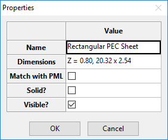

Fig. 8 - Rectangular PEC Sheet properties

Double click Rectangular PEC sheet icon again in the Available items section (section 2 of Fig. 2) to define the patch along the Y-axis. Set the properties:

- Dimensions: 
  - Cut at Plane: Z
  - z: 3 * dz
  - x from 15 * dx + 50 * dx -5.65 - 6 * dx to 15 * dx + 50 * dx -5.65
  - y from 56 * dy to 100 * dy
- Match with PML: Checked (+Y)
- Solid?: Unchecked
- Visible?: Checked

Fig. 9 shows the Rectangular PEC Sheet properties. 

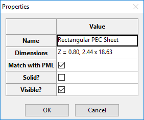

Fig. 9 - Rectangular PEC Sheet properties

The final project setup should be as shown in Fig. 10.

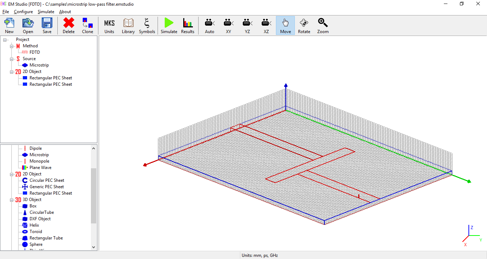

Fig. 10 - Final project setup.

After this step, it is necessary to start the simulation. Use the menu `Simulate`>`Start` or the button `Simulate` in the toolbar. Depending on the size of the project, this step can take a while.

The results are available through the menu `Simulate`>`Results` or the button `Results` in the toolbar. Fig. 11 and 12 show the results for S11 and S21 for this filter.

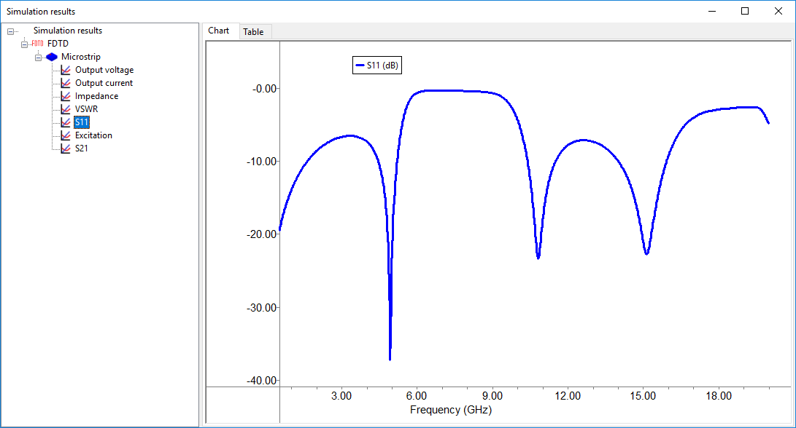

Fig. 11 - Simulation results - S11.

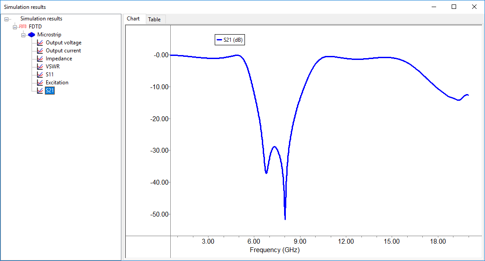

Fig. 12 - Simulation results - S12.

Fig. 13  and 14 compare S11 and S21 calculated with EM Studio and from the reference. [You can download the files to generate Fig. 13 and 14 here.](comparison.rar)

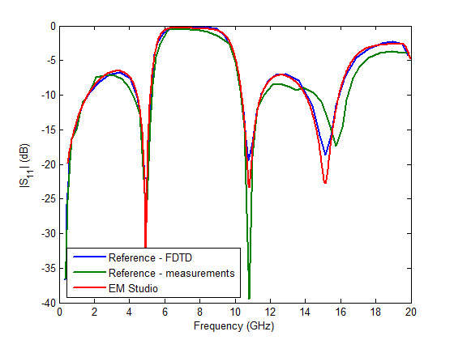

Fig. 13 - S11 calculated with EM Studio and calculated in [the reference][1].

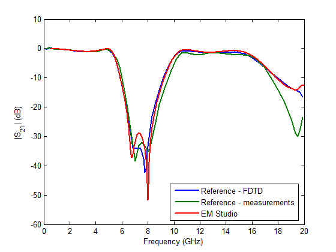

Fig. 14 - S21 calculated with EM Studio and calculated in [the reference][1].

[1]: https://doi.org/10.1109/22.55775