# Monopole mounted on a conducting rectangular box

[][1]

This sample replicates the results from the paper [FDTD method analysis of a monopole antenna mounted on a conducting rectangular area][1], published in the Antennas and Propagation Society International Symposion, 1992.

In this paper, the authors simulated a monopole antenna attached to a conducting rectangular box using the FDTD method. The box has a cross section of dimension a $\times$ b and height c (a = 60 mm, b = 10 mm, and c = 50 mm). In the top of the conducting box, at the center, there is a monopole of height h and radius r (h = 50 mm and r = 0.5 mm). The FDTD grid has delta_x = delta_y = delta_z = 1.67 mm and 110 x 90 x 180 cells. The source of the monopole is a Gaussian pulse.

With this data, the authors calculated the input impedance for frequencies below 6 GHz and the the radiation pattern at 1.5 GHz.

[You can download the project file in EM Studio here.](prj_monopole_mounted_on_a_conducting_box.emstudio)

## Configuring the project in EM Studio

Figure 1 shows EM Studio main screen. The left bottom section (2) shows all the available itens that can be to build a project. The left upper section (1) shows the project configuration. The right section (3) shows the visualization of the project. In the second panel of the status bar, the user can view (4) the units used by the project.

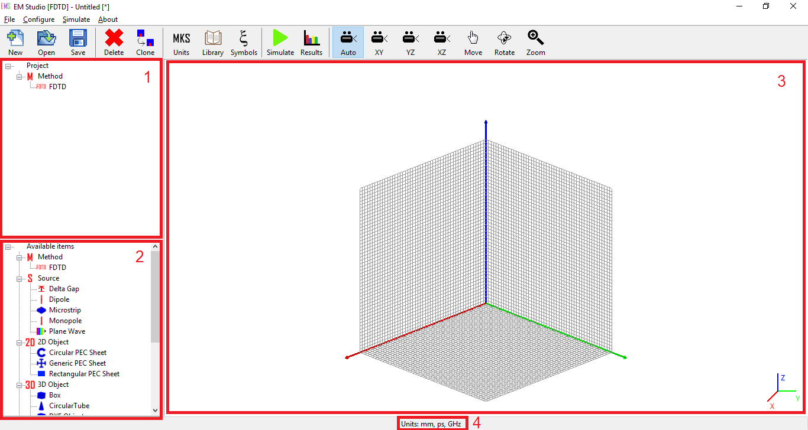

Fig. 1 - EM Studio main screen.

We will start configuring the project units. This can be done using the menu `Configure`>`Units` or using the button `Units` in the toolbar. EM Studio will show a screen to configure the units - Fig. 2. For this project, set space units as mm, time as ps and frequency as GHz.

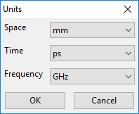

Fig. 2 - Configuring units.

To configure the project, we will use some symbols. Use the menu `Configure`>`Symbols` (or the button `Symbols` in the toolbar). EM Studio will show a screen to configure some symbols. For this project, set the symbols as shown inf Fig. 3. Latter we will use this symbol to define some elements properties. EM Studio  allows you to use symbols in some elements propertiers.

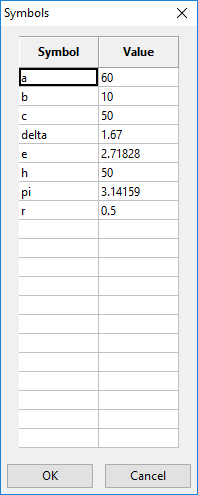

Fig. 3 - Symbols

Now, let's configure the FDTD grid. Double click at the FDTD icon in the project properties (section 1 of Fig. 1). Set the properties:

- Lower Boundary: (0, 0, 0)
- Upper Boundary: (130 * delta, 90 * delta, 180 * delta)
- Number of Cells (X): 130
- Number of Cells (Y): 90
- Number of Cells (Z): 180
- Time steps: 300
- ABC: PML in all axis, with Npml = 8

Fig. 4 shows the FDTD properties window with its Upper Boundary property available for edition. Note that the symbols previously defined can be used to define the property of the elements. Sometimes it is easier to let EM Studio do the math for you.

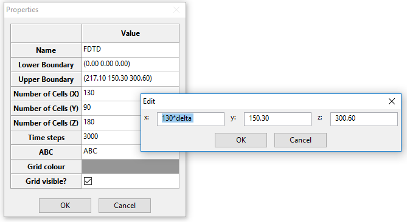

Fig. 4 - Editing Upper Boundary property of the element FDTD.

Now, double click the Box icon in the Available items section (section 2 of Fig. 1). EM Studio will show the Box properties. Set the properties:

- Lower Boundary: ( (130 * delta - a)/2, (90 * delta - b)/2, (180 * delta - c - h)/2 )
- Upper Boundary: ( (130 * delta - a)/2 + a, (90 * delta - b)/2 + b, (180 * delta - c - h)/2 + c )
- Material: PEC

Fig. 5 shows the Box properties. Note that the properties window shows the evaluated expression of the lower and upper boundary.

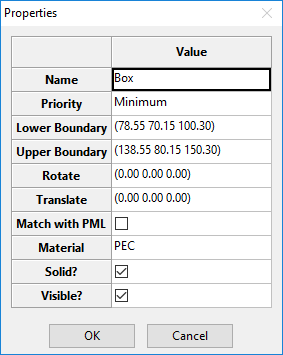

Fig. 5 - Box properties

Now, double click the Monopole icon in the Available items section (section 2 of Fig. 1). EM Studio will show the Monopole properties. Set the properties:

- Orientation: Z
- Position (bottom): (130 * delta/2, 90 * delta/2, (180 * delta - c - h)/2 + c)
- Length: h
- Wire radius: r
- Excitation: Gaussian with amplitude equals 1 and frequency equals 10
- Line impedance: 50
- Initial frequency: 0.1
- Frequency step: (10 - 0.1)/500
- N frequencies: 500

Fig. 6 shows the configure parameters of the monopole. The frequencies properties indicate that EM Studio will compute some properties of the monopole (e.g. input impedance, VSWR etc) at 500 diferent frequencies, startint at 0.1 GHz and going on with a step equals 0.0198 GHz (in this case, it calculates from 0.1 GHz to 10 GHz using 500 steps).

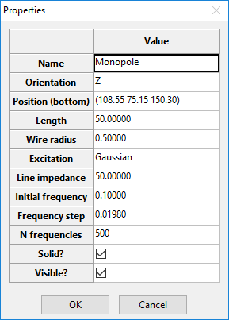

Fig. 6 - Monopole properties

To compute the radiation pattern, double click at the Radiation Pattern icon in the Available items section (section 2 of Fig. 1). It is necessary to configure where the radiation pattern is calculated and at which frequency (for this project, 1.5 GHz). In this case, we will compute it 5 cells before the border of the computational domain. Set the following properties:

- Lower Boundary: (5 * delta, 5 * delta, 5 * delta)
- Upper Boundary: (125 * delta, 85 * delta, 175 * delta)
- Initial Frequency: 1.5
- Frequency step: 0
- N frequencies: 1

Fig. 7 shows the final radiation pattern properties.

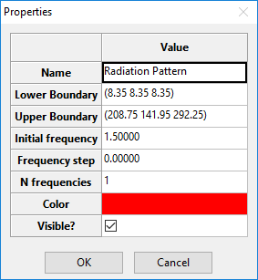

Fig. 7 - Radiation pattern properties

The final project setup should be as shown in Fig. 8.

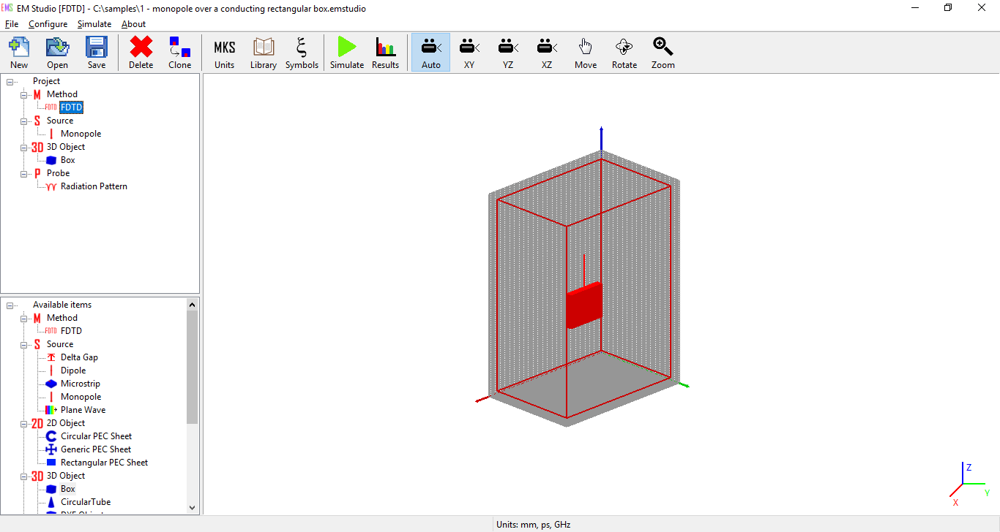

Fig. 8 - Final project setup.

After this step, it is necessary to start the simulation. Use the menu `Simulate`>`Start` or the button `Simulate` in the toolbar. Depending on the size of the project, this step can take a while.

The results are available through the menu `Simulate`>`Results` or the button `Results` in the toolbar. Fig. 9 shows the result for Impedance and Fig. 10 show the radiation pattern in the ZX plane.

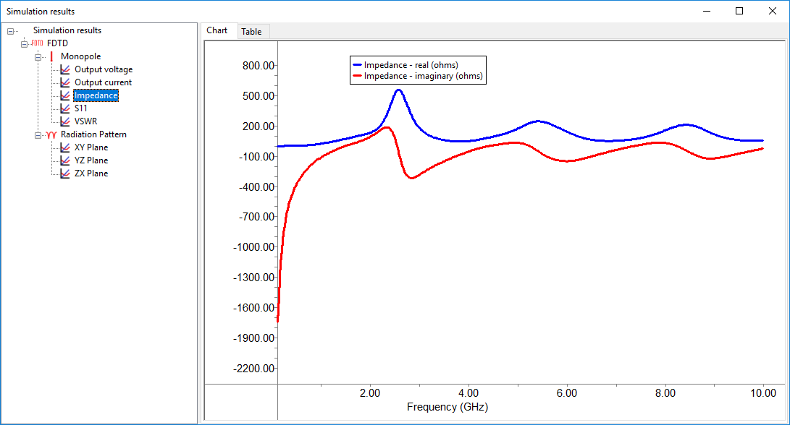

Fig. 9 - Simulation results - Impedance.

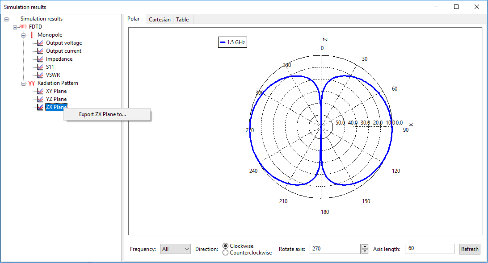

Fig. 10 - Simulation results - Radiation Pattern.

In Fig. 10 note that, if you click on the result with the right button of the mouse, EM Studio allows you to export the results. Supose that you export the ZX Plane to zxplane file. EM Studio will generate three files: zxplane-data.txt, which contains the actual data, zxplane-info.txt, which contains a textual description of the first file, and zxplane.m, which is a Matlab script to generate the same plot in Matlab (see this script in Fig. 11).

Also, note that the results might be available in different forms. For example, in Fig. 9, it is available as "Chart" and "Table". In Fig. 10, it is available as "Polar", "Cartesian", and "Table".

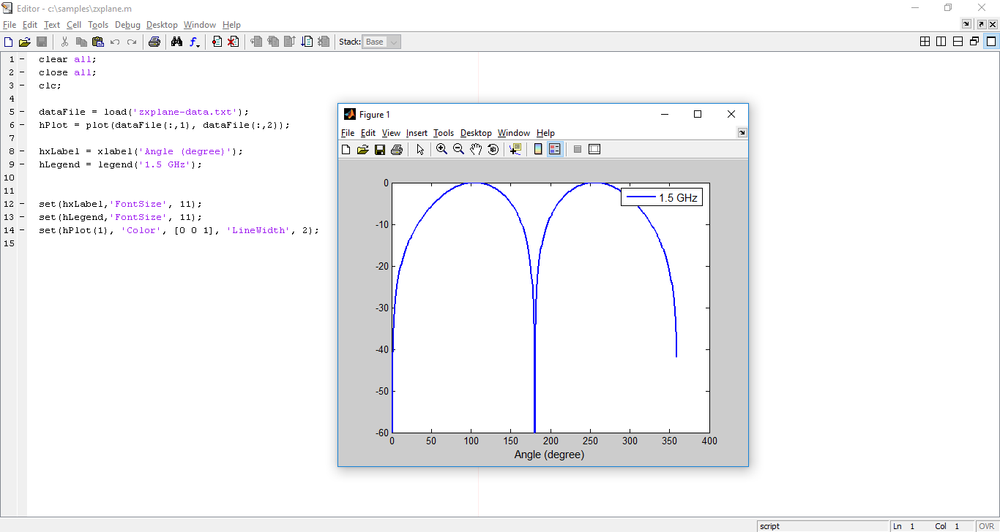

Fig. 11 - Running Matlab script.

[1]: https://doi.org/10.1109/APS.1992.221537