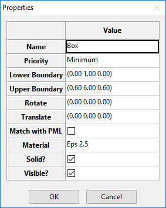

# Propagation delay through dieletric slab ([Project files](prj_microstrip_low_pass_filter.emstudio))

[][1]

This is a benchmark validation problem described in the [IEEE Recommended Pratice for Validation of Computational Electromagnetics Computer Modeling and Simulations][1].

The problem consists of a plane wave aproaching a 5 cm dieletric slab (large enough to be considered infinite in height and width). The results is the propagation delay normalized to free space for a relative dieletric constant of 2.5, 5.0, and 10.0.

Figure 1 shows the final project setup.

Fig. 1 - Problem definition.

## Configuring the project in EM Studio

Figure 2 shows EM Studio main screen. The left bottom section (2) shows all the available itens that can be to build a project. The left upper section (1) shows the project configuration. The right section (3) shows the visualization of the project. In the second panel of the status bar, the user can view (4) the units used by the project.

Fig. 2 - EM Studio main screen.

We will start configuring the project units. This can be done using the menu `Configure`>`Units` or using the button `Units` in the toolbar. EM Studio will show a screen to configure the units - Fig. 3. For this project, set space units as cm, time as ps and frequency as GHz.

Fig. 3 - Configuring units.

To configre the FDTD grid, double click at the FDTD icon in the project properties (section 1 of Fig. 2). Set the properties:

- Lower Boundary: (0, 0, 0)
- Upper Boundary: (0.6, 7, 0.6)
- Number of Cells (X): 12
- Number of Cells (Y): 140
- Number of Cells (Z): 12
- Time steps: 8000
- ABC: Periodic in X and Z axis; PML in Y axis with Npml = 8

Note that the grid has only 0.6 cm in the X and Z axis. But the simulation will consider that this structure is replicated infinitely in those axis. This is due to the absorving boundary condition (ABC) that was set to periodic. The PML was set in the Y axis to absorve the plane wave. Fig. 4 shows the FDTD properties window.

Fig. 4 - Editing Upper Boundary property of the element FDTD.

To define the dieletric slab, it is necessary to define its material. In this example, it is necessary to define 3 materials. All of them are dieletric with electric permitivity of 2.5, 5.0, and 10.0. EM Studio has a material library that can be accessed using the menu `Configure`>`Material Library` (or the button `Library` in the toolbar). To create a new material, go the the Material Library and click at the `New` button. Then, configure the materials as shown in Fig. 5.

Fig. 5 - Creating the materials.

In this project, we will use 4 project files. One for each dieltric and one for no dieletric (the problem consist in calculate the propagation delay relativ to free space). Since we need the materials when we create other project files, we need to export it to the material library. In the Material Library window, click at the `Export` button. Then, in the windows `Export to...` , click at the `Material Library` button. These steps are shown in Fig. 6.

Fig. 6 - Exporting the new materials to the Material Library.

Now, to configure the dieletric slab, double click the Box icon in the Available items section (section 2 of Fig. 2). EM Studio will show the Box properties. Lets begin with the dieletric with relative electric permitivity of 2.5. Set the properties:

- Lower Boundary: (0, 1, 0)
- Upper Boundary: (0.6, 6, 0.6)
- Material: Eps 2.5

Fig. 7 shows the Box properties. 

Fig. 7 - Box properties

Now, configure the plane wave. Double click at the Plane Wave icon in the Available items section (section 2 of Fig. 2). Set the properties:

- Lower Boundary: (0, 0.5, 0)
- Upper Boundary: (0.6, 7, 0.6)
- Direction:
  - teta: 90
  - phi: 270
  - psi: 90
- Excitation: Gausian with amplitude 1 and frequency 12.

Fig. 8 shows the Plane Wave properties. 

Fig. 8 - Plane Wave properties

Now, to inspect the Ez field after the dieletric, double click a the Field at Point icon in the Available items section (section 2 of Fig. 2). Set the properties:

- Point: (0.3, 6.3, 0.3)

- Initial frequency: 0.1

- Frequency step: 0.01

- N frequencies: 1000

- Time response?: Checked

  ​

Fig. 9 shows the Field at Point properties. 

Fig. 9 - Field at Point properties

The final project setup should be as shown in Fig. 10.

Fig. 10 - Final project setup.

After this step, it is necessary to start the simulation. Use the menu `Simulate`>`Start` or the button `Simulate` in the toolbar. Depending on the size of the project, this step can take a while.

The results are available through the menu `Simulate`>`Results` or the button `Results` in the toolbar. Right click at the result for Field at Point and export the data to some folder - Fig. 11. 

Fig. 11 - Field at Point.

Since the problem is to compare the propagation delay for some dieletrics, it is necessary to also simulate this project for relative electric permitivity equals 5.0 and 10.0. We are interested in the propagation delay relativ to the free space. So, it is also necessary to simulate it without the Box (or changing the material of the box to air).

After these simulations, you should export all the data to analyse in other software. In this tutorial, we use Matlab. The final result is shown in Fig. 12. [The files to generate this figure can be found here.](comparison.rar)

Fig. 12 - Final result.

[1]: https://doi.org/10.1109/IEEESTD.2011.5721917